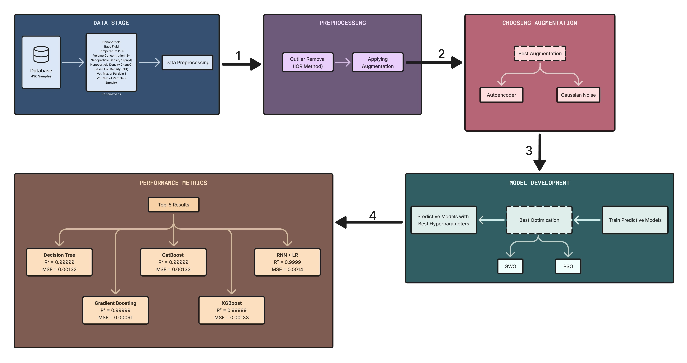

# Hybrid-Nanofluid-Density-Prediction-Dataset

This repository contains the dataset for predicting hybrid nanofluid density using various parameters. The dataset presented here is utilized in the research paper:



### [A Computational Intelligence Framework Integrating Data Augmentation and Meta-Heuristic Optimization Algorithms for Enhanced Hybrid Nanofluid Density Prediction Through Machine and Deep Learning Paradigms](https://doi.org/10.1109/ACCESS.2025.3543475)

- **Published in:** IEEE Access  
- **Publication Date:** 19 February 2025  

#### Links:

- **[Code](https://github.com/AI4A-lab/Hybrid-ML-DL_Nanofluid-Density-Predictor)**
- **[Journal Homepage](https://ieeeaccess.ieee.org/)**
- **[Journal Scopus page](https://www.scopus.com/sourceid/21100374601)**

#### Abstract
<p align="justify">
This research presents a robust and comprehensive framework for predicting the density of hybrid nanofluids using state-of-the-art machine learning and deep learning techniques. Addressing the limitations of conventional empirical approaches, the study used a curated dataset of 436 samples from the peer-reviewed literature, which includes nine input parameters such as the nanoparticle, base fluid, temperature (°C), volume concentration (φ), base fluid density (ρbf), density of primary and secondary nanoparticles (ρnp1 and ρnp2), and volume mixture ratios of primary and secondary nanoparticles. Data preprocessing involved outlier removal via the Interquartile Range (IQR) method, followed by augmentation using either autoencoder-based or Gaussian noise injection, which preserved statistical integrity and enhanced dataset diversity. The research analyzed fourteen predictive models, employing advanced hyperparameter optimization methods facilitated by Grey Wolf Optimization (GWO) and Particle Swarm Optimization (PSO). In particular, autoencoder-based augmentation combined with hyperparameter optimization consistently improved predictive accuracy across all models. For machine learning models, Gradient Boosting achieved the most remarkable performance, with R2 scores of 0.99999 and minimal MSE values of 0.00091. Among deep learning models, Recurrent Neural Networks (RNN) stacked with Linear Regression achieved superior performance with an R2 of 0.9999, MSE of 0.0014, and MAE of 0.012. The findings underscore the synergy of advanced data augmentation, meta-heuristic optimization, and modern predictive algorithms in modelling hybrid nanofluid density with unprecedented precision. This framework offers a scalable and reliable tool for advancing nanofluid-based applications in thermal engineering and related domains.
</p>

## Table of Contents

- [Dataset](#dataset)
- [Citation](#citation)
- [License](#license)

#### Other Details
- [Introduction](#introduction)
- [Methodology](#methodology)
- [Augmentation Techniques](#augmentation-techniques)
- [Optimization Algorithms](#optimization-algorithms)
- [Implemented Models](#implemented-models)
- [Results and Discussion](#results-and-discussion)

## Dataset

The experimental dataset consists of **436 samples** extracted from peer-reviewed literature. Each sample is characterized by:

- **Input Parameters:** Nanoparticle type, base fluid, temperature (°C), volume concentration (φ), base fluid density (ρ<sub>bf</sub>), density of primary (ρ<sub>np1</sub>) and secondary nanoparticles (ρ<sub>np2</sub>), and volume mixture ratios.
- **Output Parameter:** Hybrid nanofluid density (ρ<sub>hybrid</sub>).

#### The dataset is also available to be downloaded from following sites, given the paper is referenced in the study:

- **[Kaggle](https://www.kaggle.com/datasets/ai4a-lab/nanofluid-density-prediction)**
- **[HuggingFace]()**

## Citation

If you are using the dataset, please cite using this BibTeX:
```bibtex
@ARTICLE{10892114,
  author={Mathur, Priya and Shaikh, Hammad and Sheth, Farhan and Kumar, Dheeraj and Gupta, Amit Kumar},
  journal={IEEE Access}, 
  title={A Computational Intelligence Framework Integrating Data Augmentation and Meta-Heuristic Optimization Algorithms for Enhanced Hybrid Nanofluid Density Prediction Through Machine and Deep Learning Paradigms}, 
  year={2025},
  volume={13},
  number={},
  pages={35750-35779},
  keywords={Autoencoders;Nanoparticles;Predictive models;Machine learning;Fluids;Prediction algorithms;Gaussian noise;Deep learning;Data models;Data augmentation;Density prediction;hybrid nanofluids;machine learning;deep learning;data augmentation;meta-heuristic optimization;optimization algorithms;thermal engineering},
  doi={10.1109/ACCESS.2025.3543475}}
```


## License

This project is licensed under:

[Creative Commons Attribution-NonCommercial 4.0 International License][cc-by-nc].

[![CC BY-NC 4.0][cc-by-nc-shield]][cc-by-nc]

[![CC BY-NC 4.0][cc-by-nc-image]][cc-by-nc]

[cc-by-nc]: https://creativecommons.org/licenses/by-nc/4.0/
[cc-by-nc-image]: https://licensebuttons.net/l/by-nc/4.0/88x31.png
[cc-by-nc-shield]: https://img.shields.io/badge/License-CC%20BY--NC%204.0-lightgrey.svg

see the [LICENSE](LICENSE) file for details.

----

# Other Information:

## Introduction

The goal of this project was to provide a comprehensive framework for predicting hybrid nanofluid density using advanced computational intelligence techniques. The work includes data preprocessing, augmentation, model training, and optimization, supporting both machine learning and deep learning paradigms. This approach addresses the inherent challenges of modeling complex thermophysical properties with high accuracy and robustness.


## Methodology

The workflow is divided into two key phases:

1. **Data Preprocessing:**  
   - Cleaning and normalization of data using techniques such as outlier removal via the IQR method.  
   - Binary vector encoding for categorical variables.

2. **Model Training and Optimization:**  
   - Implementation of fourteen predictive models spanning machine learning and deep learning architectures.  
   - Integration of advanced data augmentation (autoencoder-based and Gaussian noise injection) to improve training data diversity.  
   - Application of meta-heuristic optimization algorithms (GWO and PSO) to fine-tune model hyperparameters.


## Augmentation Techniques

- **Autoencoder-Based Augmentation:**  
  Utilizes an autoencoder network to generate synthetic samples by reconstructing input data, thereby enhancing the training set while preserving statistical properties.

- **Gaussian Noise Injection:**  
  Expands the dataset by adding controlled Gaussian noise to input samples, improving model robustness against real-world variations.


## Optimization Algorithms

To fine-tune model performance, two meta-heuristic optimization techniques are employed:

- **Grey Wolf Optimization (GWO):**  
  Inspired by the social hierarchy and hunting behavior of grey wolves, this algorithm efficiently explores the hyperparameter space to find optimal configurations.

- **Particle Swarm Optimization (PSO):**  
  Mimics the social behavior of bird flocking and fish schooling, iteratively updating candidate solutions to achieve high accuracy in model predictions.


## Implemented Models

The work includes implementations of fourteen predictive models and their ensemble variant (stacked with Linear Regression), the models included in the study are detailed as follows:

- **Machine Learning Models:**  
  - Decision Tree  
  - Random Forest  
  - Ridge Regression  
  - Poisson Regression  
  - Gradient Boosting  
  - LightGBM  
  - CatBoost  
  - XGBoost

- **Deep Learning Models:**  
  - Neural Networks  
  - Convolutional Neural Networks (CNN)  
  - Recurrent Neural Networks (RNN)  
  - Gated Recurrent Units (GRU)  
  - Long Short-Term Memory (LSTM)  
  - Autoencoders

Each model and their variant were evaluated based on performance metrics such as R2 Score, Mean Squared Error (MSE), Root Mean Squared Error (RMSE), Mean Absolute Error (MAE), MAPE, SMAPE, EVS, and Max Error.


## Results and Discussion

Experimental results show that the integration of autoencoder-based augmentation and meta-heuristic optimization significantly enhances the predictive performance of the models. Particularly, autoencoder-based augmentation combined with hyperparameter optimization consistently improved predictive accuracy across all models. For machine learning models, Gradient Boosting achieved the most remarkable performance, with R2 scores of 0.99999 and minimal MSE values of 0.00091. Among deep learning models, Recurrent Neural Networks (RNN) stacked with Linear Regression achieved superior performance with an R2 of 0.9999, MSE of 0.0014, and MAE of 0.012. Detailed analyses, comparative evaluations, and visualization outputs are provided in the paper's Results section.